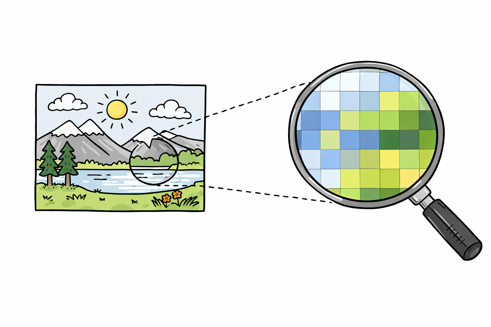
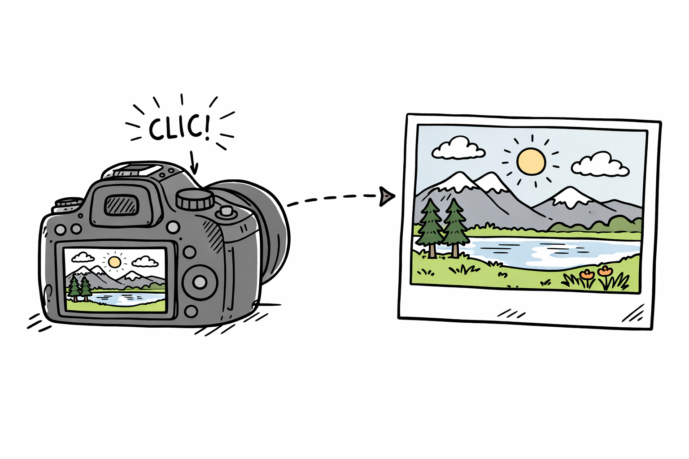
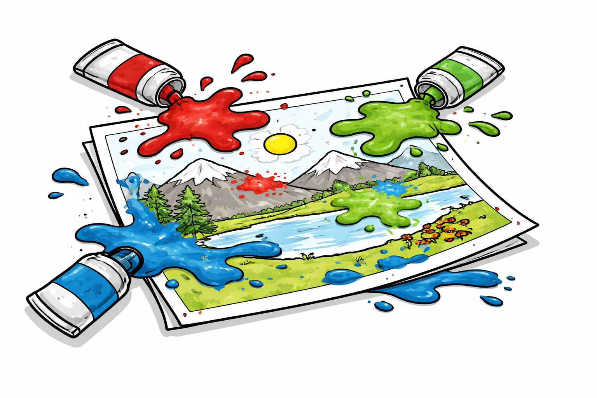
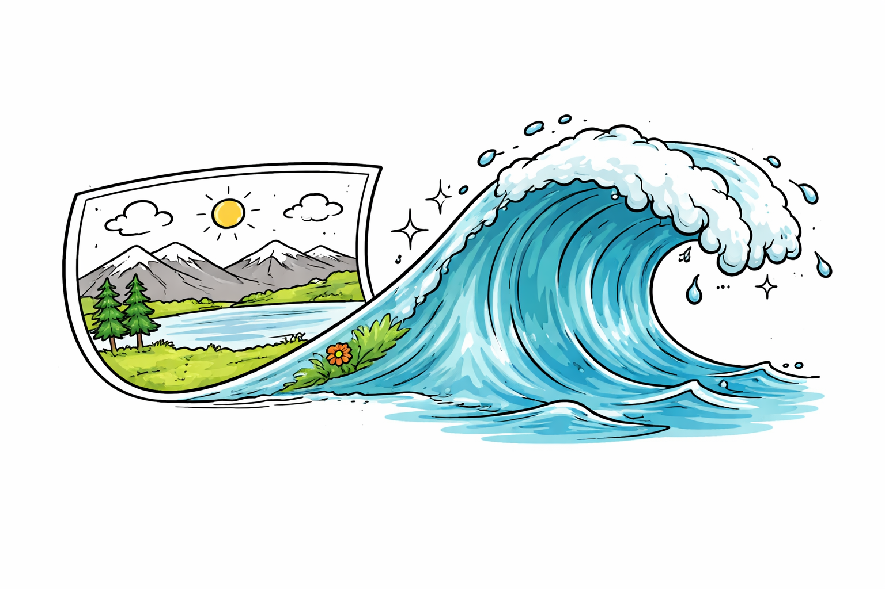
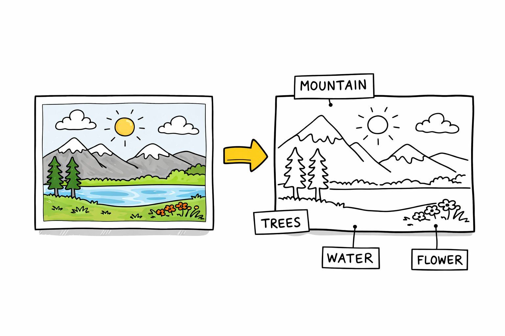
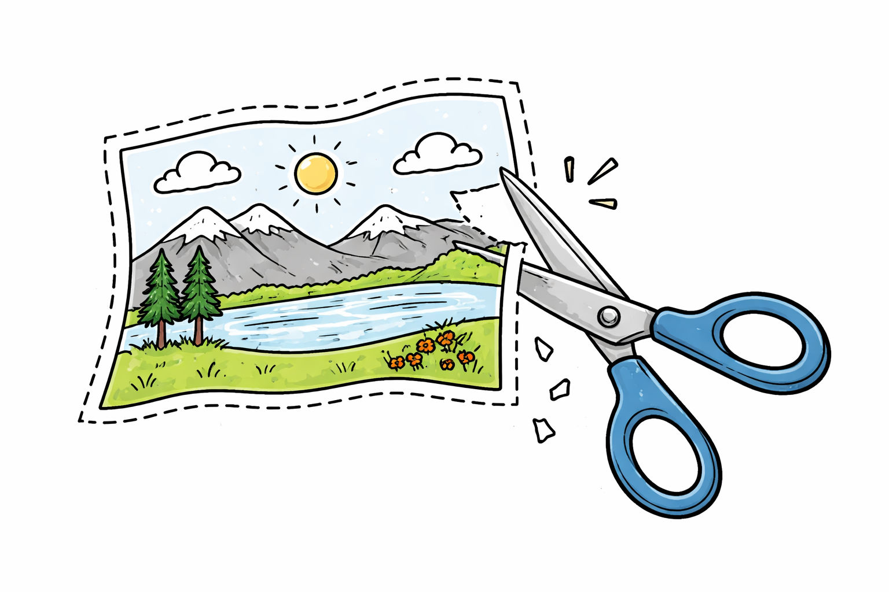
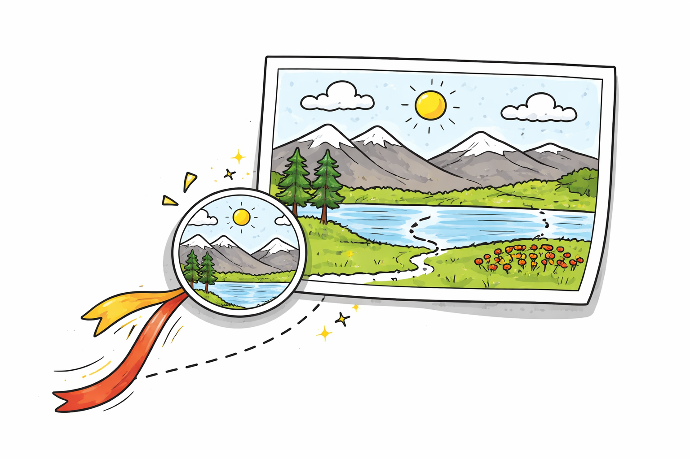
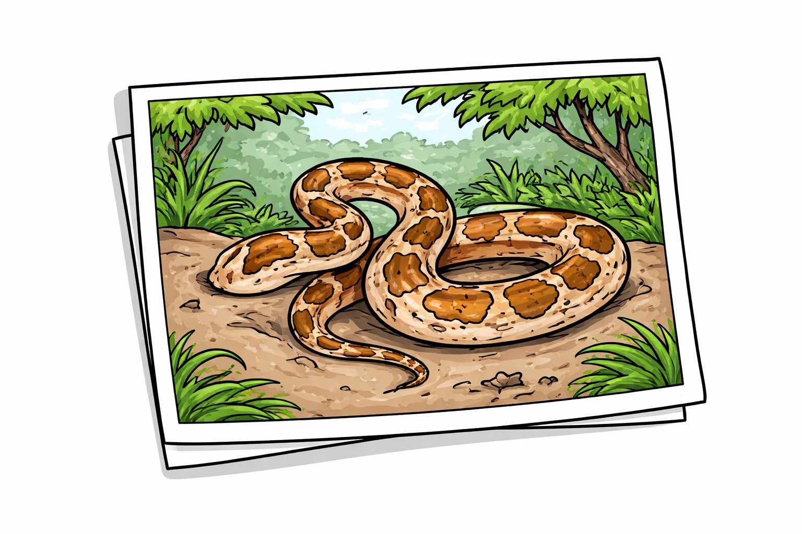
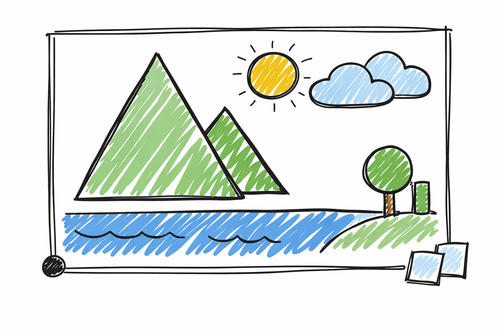
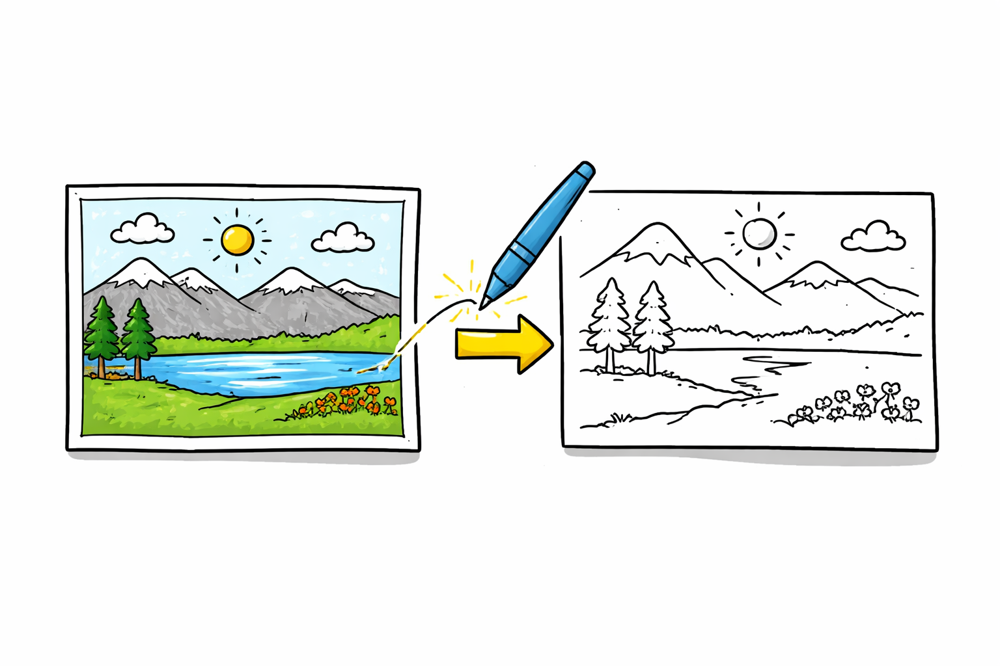

# Créditos das Imagens

As imagens utilizadas ao longo deste livro foram selecionadas de forma a garantir acessibilidade, clareza didática e respeito aos direitos autorais. Parte delas foi obtida no repositório Wikimedia Commons (@fig-avenida, @fig-cao1, @fig-cao2, @fig-cao3, @fig-cao4, @fig-cao5, @fig-cao6, @fig-cao7, @fig-cao8, @fig-mariposa, @fig-flor1, @fig-flor2, @fig-food1), que disponibiliza conteúdos sob licenças livres, permitindo seu uso e adaptação com a devida atribuição. Complementarmente, algumas imagens foram geradas com o auxílio de ferramentas de inteligência artificial, como ChatGPT (@fig-fig-moire5, @fig-silhueta, @fig-conesCC, @fig-olhoCC, @fig-amostra, @fig-captura, @fig-compressao, @fig-cores, @fig-fourier, @fig-interpretacao, @fig-melhoramento, @fig-morfologia, @fig-python, @fig-representa e @fig-segmenta) e Gemini (@fig-food2), com o objetivo de ilustrar conceitos específicos de maneira personalizada. Sempre que aplicável (@fig-monalisa), buscou-se indicar a origem e a licença das imagens, assegurando transparência e conformidade com as boas práticas de uso de conteúdo visual.

{#fig-avenida width="60%" fig-align="center"} 

{#fig-cao1 width="60%" fig-align="center"} 

{#fig-cao2 width="60%" fig-align="center"} 

{#fig-cao3 width="60%" fig-align="center"} 

{#fig-cao4 width="60%" fig-align="center"} 

{#fig-cao5 width="60%" fig-align="center"} 

{#fig-cao6 width="60%" fig-align="center"} 

{#fig-cao7 width="60%" fig-align="center"} 

{#fig-cao8 width="60%" fig-align="center"} 

{#fig-mariposa width="60%" fig-align="center"} 

{#fig-monalisa width="60%" fig-align="center"} 

{#fig-flor1 width="60%" fig-align="center"} 

{#fig-flor2 width="60%" fig-align="center"} 

{#fig-food1 width="60%" fig-align="center"} 

{#fig-food2 width="60%" fig-align="center"} 

{#fig-moire5 width="60%" fig-align="center"}

{#fig-silhueta width="60%" fig-align="center"}

{#fig-conesCC width="60%" fig-align="center"}

{#fig-olhoCC width="60%" fig-align="center"}

{#fig-amostra width="60%" fig-align="center"}

{#fig-captura width="60%" fig-align="center"}

{#fig-compressao width="60%" fig-align="center"}

{#fig-cores width="60%" fig-align="center"}

{#fig-fourier width="60%" fig-align="center"}

{#fig-interpretacao width="60%" fig-align="center"}

{#fig-melhoramento width="60%" fig-align="center"}

{#fig-morfologia width="60%" fig-align="center"}

{#fig-python width="60%" fig-align="center"}

{#fig-representa width="60%" fig-align="center"}

{#fig-segmenta width="60%" fig-align="center"}
