## Representação Digital de Imagens

- Imagens do mundo real são **contínuas**
  - No espaço
  - Na intensidade luminosa
- Computadores trabalham com informações **discretas**
- A conversão ocorre por meio de:
  - **Amostragem**
  - **Quantização**

---

## Objetivo do Capítulo

- Compreender:
  - Como imagens contínuas tornam-se digitais
  - A relação com o sistema visual humano
  - O papel dos sensores
- Estabelecer base para:
  - Filtragem
  - Segmentação
  - Compressão
  - Reconhecimento de padrões

---

## Sistema de Processamento de Imagens

- Etapas principais:
  - Aquisição
  - Processamento
  - Armazenamento
  - Saída

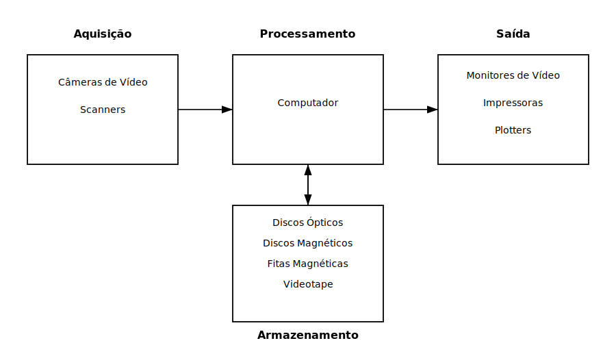

---

## Sistema Visual Humano

- Inspiração para sistemas computacionais
- O olho atua como um sistema óptico
- A interpretação final ocorre no cérebro

---

## Formação da Imagem no Olho

- Luz atravessa:
  - Córnea
  - Cristalino
- A imagem é formada na retina
- A imagem retinal é **invertida**

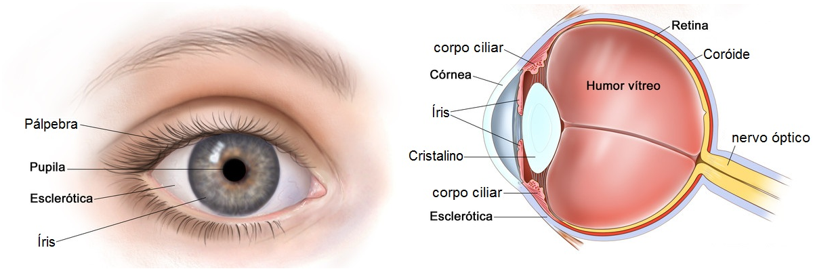

---

## Fóvea, Cones e Bastonetes

- **Bastonetes**
  - Alta sensibilidade à luz
  - Percepção de brilho
- **Cones**
  - Percepção de cores
- **Fóvea**
  - Alta densidade de cones
  - Alta acuidade visual

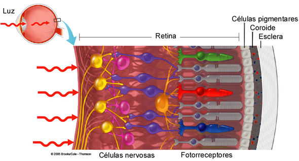

---

## Ilusões de Ótica

- Evidenciam limitações da percepção humana
- O cérebro completa informações ausentes
- Intensidade percebida ≠ intensidade física

---

## Exemplos de Ilusões

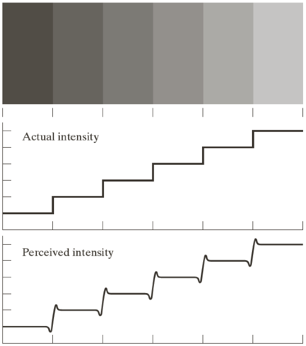

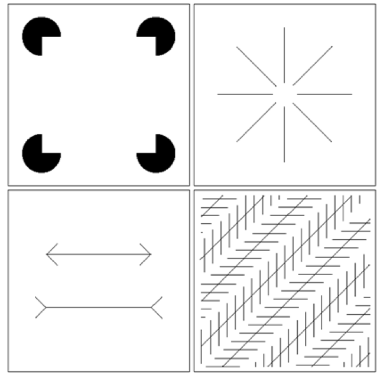

---

## Sensores e Imagens Digitais

- Sensores convertem luz em sinais elétricos
- Base para aquisição digital de imagens

---

## Espectro Visível

- Faixa estreita do espectro eletromagnético
- Do violeta ao vermelho
- Suficiente para grande parte das aplicações visuais

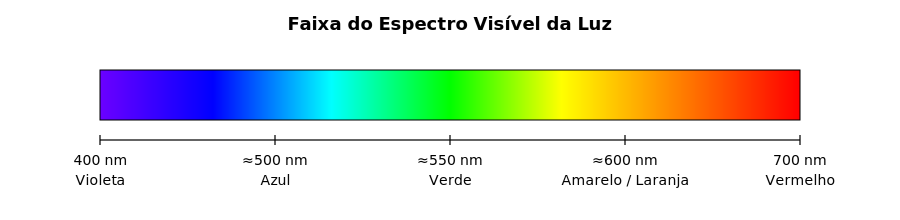

---

## Tipos de Sensores

- **Sensores lineares**
  - Captura linha a linha
- **Sensores matriciais**
  - Matrizes CCD ou CMOS
  - Mais comuns em câmeras digitais

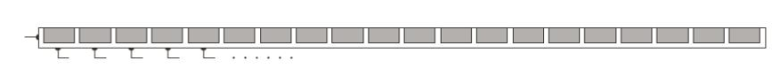

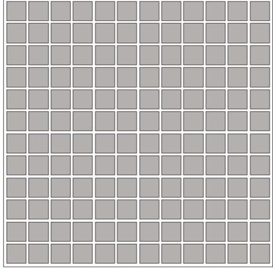

---

## Amostragem

- Discretização **espacial**
- Cena contínua → grade de pontos
- Cada ponto corresponde a um **pixel**

---

## Amostragem Matemática

- Função contínua:
  - \( f(x,y) \)
- Após amostragem:
  - Definida apenas em posições discretas

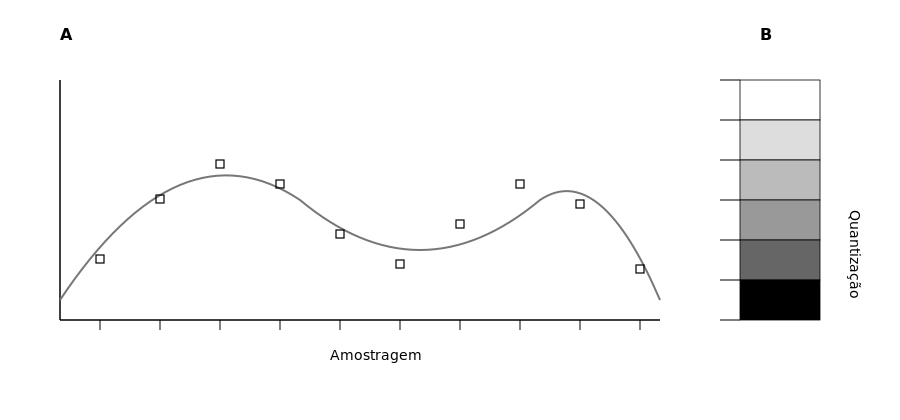

---

## Resolução Espacial

- Relacionada ao número de amostras
- Frequentemente expressa em **DPI**
- Maior resolução → mais detalhes
- Impacta:
  - Qualidade visual
  - Custo computacional

---

## Quantização

- Discretização dos valores de intensidade
- Define **quais valores** um pixel pode assumir
- Complementa a amostragem

---

## Níveis de Intensidade

- Número de níveis:
\[
L = 2^k
\]
- \(k\): número de bits por pixel
- Exemplo:
  - 8 bits → 256 níveis
  - 4 bits → 16 níveis

---

## Profundidade de Bits

- Afeta diretamente:
  - Qualidade visual
  - Presença de bandas
  - Perda de detalhes

---

## Representação Matricial

- Imagem digital → matriz numérica
- Cada elemento representa um pixel

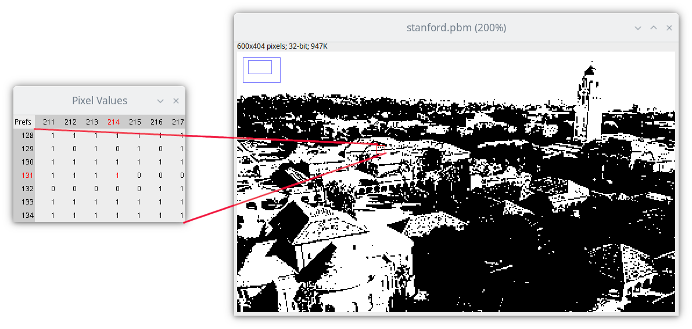

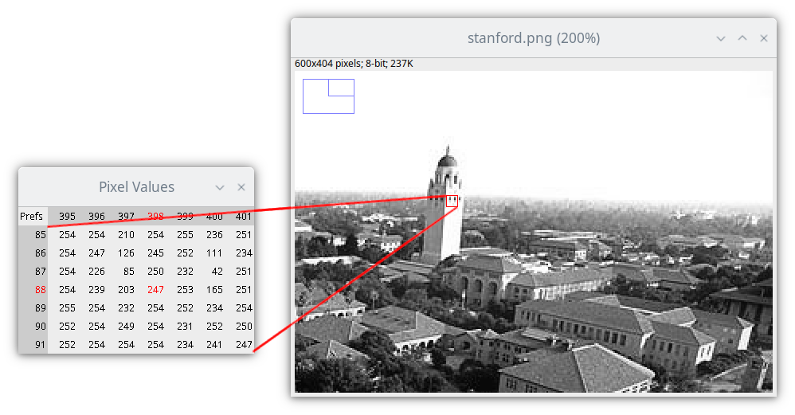

---

## Visualização Ampliada (Zoom)

::: {.content-visible when-format="html"}
<iframe 
  src="https://editor.p5js.org/luizedsilva/full/bDwv1wtRH"
  width="100%"
  height="500"
  style="border:none;">
</iframe>
:::

::: {.content-visible when-format="pdf"}
Exemplo interativo disponível em:

https://editor.p5js.org/luizedsilva/full/bDwv1wtRH
:::

---

## Imagens Coloridas

- Representação por:
  - Tabelas de cores
  - Canais RGB

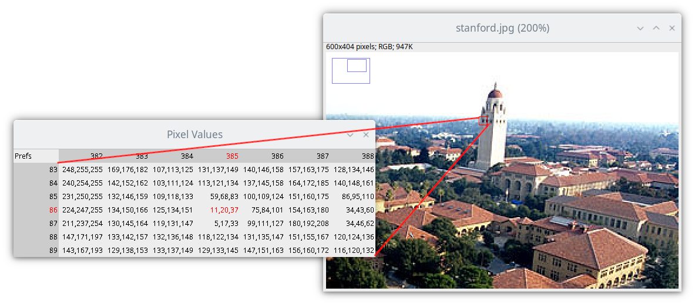

---

## Superfície de Intensidade

- Imagem como função 3D
- Intensidade → altura da superfície

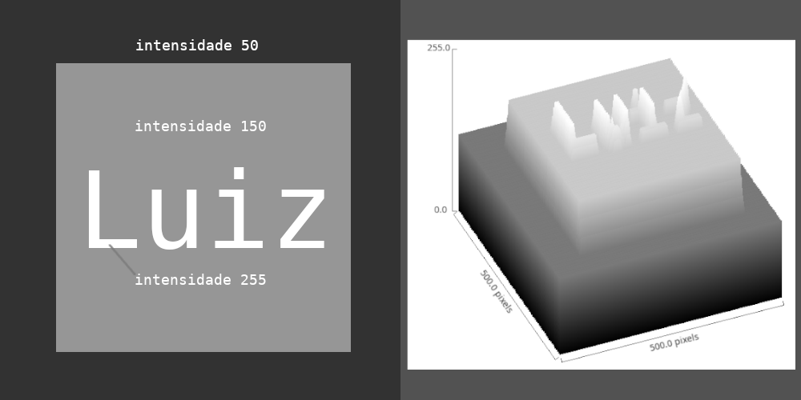

---

## Formatos PBM, PGM e PPM

- Família **Netpbm**
- Representação explícita dos pixels
- Muito usados em ensino e pesquisa

---

## PBM – Imagens Binárias

- Dois valores possíveis por pixel
- Ideal para:
  - Máscaras
  - Segmentação
  - Limiarização

---

## PGM – Tons de Cinza

- Um valor por pixel
- Facilita:
  - Análise
  - Filtragem
  - Realce

---

## PPM – Imagens Coloridas

- Modelo RGB
- Três valores por pixel
- Arquivos maiores, mas simples

---

## ASCII vs Binário

- ASCII:
  - Legível
  - Didático
- Binário:
  - Mais compacto
  - Mais eficiente

---

## Importância Didática

- Relaciona números ↔ aparência visual
- Facilita a compreensão de:
  - Pixel
  - Quantização
  - Cor
  - Intensidade

---

## Considerações Finais

- Amostragem e quantização são fundamentais
- Definem:
  - Qualidade visual
  - Armazenamento
  - Complexidade computacional
- Base para técnicas mais avançadas de PDI

---

## Próximos Tópicos

- Filtragem
- Transformações espaciais
- Domínio da frequência
- Transformada de Fourier